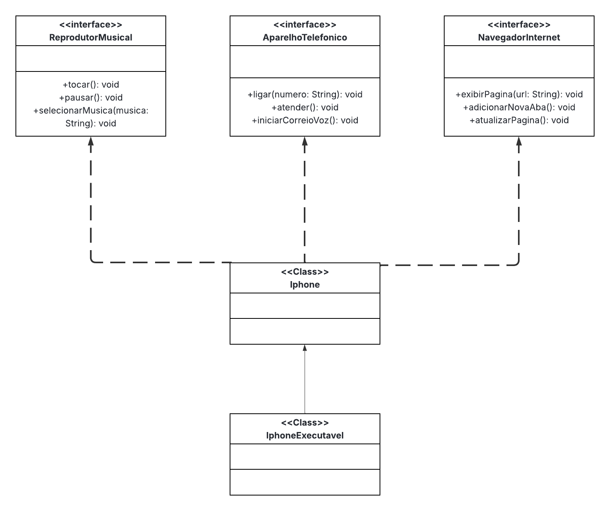

# Desafio de POO: Modelagem e Diagramação de um Componente iPhone

## Contexto
Este projeto visa modelar, através dos conceitos de Programação Orientada a Objetos (POO), as funcionalidades centrais de um iPhone, conforme apresentado por Steve Jobs no vídeo de lançamento de 2007. O foco está na criação de interfaces que representam os papéis de Reprodutor Musical, Aparelho Telefônico e Navegador na Internet, e em seguida, na implementação dessas funcionalidades em uma classe principal `Iphone`.

## Funcionalidades a Modelar
O componente iPhone será modelado a partir de três interfaces distintas, cada uma com um conjunto de métodos específicos, foi ultilizado uma classe pai Iphone para implentar os métodos e obter melhor organização e a criação da classe IphoneExecutavel para a ultilização dos métodos.

## Diagrama UML

